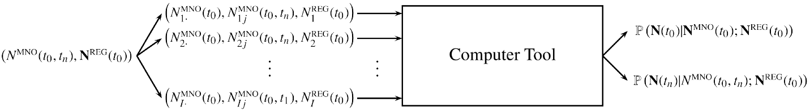

\newtheorem{lemma}{Lemma}
\newcommand{\appropto}{\mathrel{\vcenter{
  \offinterlineskip\halign{\hfil$##$\cr
    \propto\cr\noalign{\kern2pt}\sim\cr\noalign{\kern-2pt}}}}}

```{r, echo = FALSE, message = FALSE}
#```{r setup, include=FALSE}
knitr::opts_chunk$set(collapse = T, comment = "#>")
```

# Introduction

This vignette explains how to estimate population with `pestim` package.

This package include functions for a hierarchical model to estimate population counts using a combination of aggregated mobile phone data and official data both at a given time instant and along a sequence of time periods. 

Also, we show how to extend the estimates along a sequence of time instants, not just the initial one.

This approach is using the ecological sampling techniques to estimate population counts (see e.g. Manly and Navarro Alberto (2015)).
In particular, we follow the work by Royle and Dorazio (2008).

In this first proposal we envisage the inference exercise from both mobile phone and official data to population counts as a two-step process. Firstly using the official data we assume that they correspond to a given time instant $t_{0}$ so that at this time instant both mobile phone and official data are used to infer the population counts in each territorial cell. Then, for later time instants, we shall infer transition probabilities using only mobile phone data to study the spatial and time evolution of the population.

For the time being we will concentrate on mathematical aspects of the model for the first step and a preliminary prototyping implementation to assess the performance of the model. In separate documents we will consider the details about the second step and all the software implementation.

# The hierarchical model

## Setting up the model

Firstly we set the notation. We shall denote by $\mathbf{N}^{\textrm{MNO}}=(N_{1}^{\textrm{MNO}}, \dots, N_{I}^{\textrm{MNO}})^{T}$ the population counts according to the mobile devices reported by the mobile network operator in each territorial cell $i\in\mathcal{I}=\{1,\dots,I\}$ (i.e. the aggregated mobile phone data). These can refer to general population counts, tourist counts, commuters counts, etc. This is considered as an input in the model. Along with the efforts to gain access to mobile phone data NSIs will have also to develop methodologies to obtain these aggregated data out of statistical microdata. Following the generic bottom-up approach of the ESSnet we will concentrate on the part of the process upon which we can carry out concrete analyses. The issue of the access to these microdata must be conveniently solved to follow an empirical approach on the processing of microdata. For the present project we will cover this part of the production process with the internal technical reports by Positium.

In the model, we will make use as auxiliary information of the official population register number of individuals $\mathbf{N}^{\textrm{REG}}=(N_{1}^{\textrm{REG}}, \dots, N_{I}^{\textrm{REG}})^{T}$ in each of the cells or some equivalent survey or administrative source. The goal is to provide estimates for the actual population counts $\mathbf{N}=(N_{1}, \dots, N_{I})^{T}$ combining both data sources. The interplay between official data and mobile phone data will also be discussed elsewhere (see also the internal documents of the WP5).

More rigorously, aiming at the quality assessment of the estimation procedure, we will produce a probability distribution for the number of individuals of the target population in each cell $i$ using both the mobile phone and official population data as inputs (see figure \ref{Tool}). The posterior probability distribution $\mathbb{P}\left(\mathbf{N}|\mathbf{N}^{\textrm{MNO}};\mathbf{N}^{\textrm{REG}}\right)$ will allow us to assess the uncertainty in the output estimates.

<figure>
  
</figure>

We propose the hierarchical model given by:

\begin{align}
N_{i}^{\textrm{MNO}}&\simeq\textrm{Bin}\left(N_{i}, p_{i}\right),\qquad N_{i}^{\textrm{MNO}}\perp N_{j}^{\textrm{MNO}},\quad i\neq j=1,\dots,I\\
N_{i}&\simeq\textrm{Po}\left(\lambda_{i}\right),\qquad N_{i}\perp N_{j},\quad i\neq j=1,\dots,I\nonumber\\
p_{i}&\simeq\textrm{Beta}\left(\alpha_{i},\beta_{i}\right),\qquad p_{i}\perp p_{j}\quad i\neq j=1,\dots,I\nonumber\\
\left(\alpha_{i}, \beta_{i}\right)&\simeq \frac{f_{1}(\frac{\alpha_{i}}{\alpha_{i}+\beta_{i}}; \mathbf{N}^{\textrm{REG}}, \mathbf{z})\cdot f_{2}(\alpha_{i}+\beta_{i}; \mathbf{N}^{\textrm{REG}}, \mathbf{z})}{\alpha_{i}+\beta_{i}},\qquad (\alpha_{i},\beta_{i})\perp(\alpha_{j},\beta_{j}),\quad i\neq j=1,\dots,I\nonumber\\
\lambda_{i}&\simeq f_{3}(\lambda_{i}; N_{i}^{\textrm{REG}}, \mathbf{z})\quad (\lambda_{i} > 0, \lambda_{i}\perp\lambda_{j}), \quad i=1,\dots,I.\nonumber
\end{align}

## Interpretating the model

The interpretation of the model is more or less straightforward. If in a territorial cell $i$ there are $N_{i}$ individuals and we have an independent detection probability $p_{i}$ for each individual through the mobile telecommunication network, then we will detect $N_{i}^{\textrm{MNO}}$ individuals according to the aggregated mobile phone data naturally following a binomial distribution. 

Now, the number of individuals $N_{i}$ in each cell can be understood as a Poisson random variable (potentially arising from an underlying birth-death Poisson process). These variables are pairwise independent and depend on unknown independent parameters $\lambda_{i}$. For the time being we will keep the model as simple as possible to test a first proof of concept.

Now, the detection probabilities $p_{i}$ in our mobile phone setting differs from the usual ecological setting. In the latter, the field work (observation sites, visual techniques, \dots) allows us to propose a model for these probabilities according to the measurement process. In the telecommunication setting, in principle, the measurement process in cell $i$ is always successful provided that a subscriber interacting with the network is within the territorial cell $i$. Thus at the given instant of time $t_{0}$ the detection probabilities $p_{i}$ amount to establish the proportion of individuals of interest at each cell $i$ being detected by the MNO's cellular network. In other words, $p_{i}$ are the proportions of individuals detected by the MNO at time $t_{0}$ in each cell $i$.

It is interesting to make a short reflection about these proportions $p_{i}$ and the so-called local market shares. The latter are the number of subscribers of a given MNO in a cell $i$ and they are sometimes considered as an important piece of information in performing the inference exercise from mobile phone data to the target population. We must stress that, in our view, it is not the concept of market share which is important but that of the actual proportion of individuals detected by the network. As an illustrative example, a call between a subscriber in a cell $i$ and a non-subscriber in another cell $j$ of a given MNO is certainly detected by the network in \emph{\textbf{both cells}}, thus potentially being part of the aggregated data $N_{i}^{\textrm{MNO}}$ and $N_{j}^{\textrm{MNO}}$. This is a clear example of why having knowledge of the preprocessing and aggregation procedures from microdata is important for the final results.

We will model the detection probabilities $p_{i}$ to account for the uncertainty we have in these quantities. Thus they are modelled as beta random variables with parameters $\alpha_{i}, \beta_{i}$ independently in each cell. The prior distribution of the beta distribution parameters $\alpha_{i}, \beta_{i}$ arises from the following reasoning. We assume that $\frac{\alpha_{i}}{\alpha_{i} + \beta_{i}}$ and $\alpha_{i} + \beta_{i}$ distribute independently according to $\frac{\alpha_{i}}{\alpha_{i} + \beta_{i}}\simeq f_{1}(\frac{\alpha_{i}}{\alpha_{i}+\beta_{i}}; \mathbf{N}^{\textrm{REG}}, \mathbf{z})$  and $\alpha_{i} + \beta_{i}\simeq f_{2}(\alpha_{i}+\beta_{i}; \mathbf{N}^{\textrm{REG}}, \mathbf{z})$, where $f_{1}$ and $f_{2}$ are respective weakly informative prior distributions for $\frac{\alpha}{\alpha + \beta}$ and $\alpha + \beta$. Notice that we have again made use of the auxiliary information coming from the population register ($\mathbf{N}^{\textrm{REG}}$) and any other auxiliary information $\mathbf{z}$. The quantity $\alpha_{i}/(\alpha_{i}+\beta_{i})$ can be understood as a priori proportions of individuals detected by the MNO in cell $i$ (e.g. should we have no information, then $f_{1}=\textrm{Unif}[0,1]$). The parameters $\alpha_{i}+\beta_{i}$ can be essentially understood as the population size of each cell $N_{i}$ (thus with support in $(0,\infty)$) upon which the detection is executed at that time instant. For example, we may assume $f_{2}$ to be a gamma distribution with parameters $(N_{i}^{\textrm{MNO}} + 1, \frac{N_{i}^{\textrm{MNO}}}{N_{i}^{\textrm{REG}}})$. In this way, the most probable value for the sample size is $N_{i}^{\textrm{REG}}$ in consonance with the preceding hypothesis for $N_{i}$.

Finally, the parameters $\lambda_{i}$ are modeled with another weakly information prior $f_{3}$ which may incorporate the information we have from the population register or similar sources. Notice that the only a priori information incorporated is coming from this auxiliary source.

There is a clear abuse of notation by denoting both random variables and their realization in the same way (the context will make this clear).  $\mathbf{N}^{\textrm{REG}}$ are treated as fixed parameters in the current model. By relaxing this and modelling also $\mathbf{N}^{\textbf{REG}}$ we can pave the way to account for proposing more complex models for the uncertainty (possible non-sampling errors) in the official population figures for this estimation procedure.

Notice also that the cells are treated independently leaving the door open for geostatitical considerations naturally accounting for geospatial correlations among the cells. We will concentrate here on the preceding simple model to provide a proof of concept.


## Getting the flavour of the model

To get a flavour of the model, let us make the following simplifying assumption. Let us suppose that the prior distributions $f_{1}$ and $f_{2}$ are degenerate so that equivalently we are assuming that we have full knowledge of the a priori proportion of detected individuals\footnote{For ease of notation we drop out the subscripts $i$ regarding the cells, since they are independent.} $u=\frac{\alpha}{\alpha+\beta}=u^{*}$ and of the population cell size $N^{*}=\alpha+\beta$ whose proportion of subscribers is detected by our MNO.

Then it is straighforward to show that the unnormalized posterior probability density $\mathbb{P}\left(\lambda|N^{\textrm{MNO}}; N^{\textrm{REG}}\right)$ is given by 

\begin{align}
\mathbb{P}\left(\lambda|N^{\textrm{MNO}}; N^{\textrm{REG}}\right)&\propto f_{3}(\lambda; N^{\textrm{REG}})\cdot\textrm{Po}\left(N^{\textrm{MNO}}; \lambda\right)\cdot\sum_{n=0}^{\infty}\frac{\lambda^{n}}{n!}\frac{B(u^{*}\cdot N^{*} + N^{\textrm{MNO}}, (1-u^{*})\cdot N^{*} + n)}{B(u^{*}\cdot N^{*}, (1-u^{*})\cdot N^{*})}\nonumber\\
&\appropto f_{3}(\lambda; N^{\textrm{REG}})\cdot \textrm{Po}\left(N^{\textrm{MNO}}; \lambda\right)\cdot \sum_{n=0}^{\infty}\frac{\lambda^{n}}{n!}\cdot u^{*N^{\textrm{MNO}}}\cdot (1- u^{*})^{n} \nonumber\\
\label{EBprob}&\appropto f_{3}(\lambda; N^{\textrm{REG}})\cdot e^{-\lambda u^{*}}\cdot\frac{(\lambda u^{*})^{N^{\textrm{MNO}}}}{N^{\textrm{MNO}}!},
\end{align}

\noindent where we have used the approximation $\frac{\Gamma(x + a)}{\Gamma(x)}\approx x^{a}$ (which can be proved using Stirling's approximation) and where $\textrm{Po}(N; \lambda)$ denotes the probability function of a Poisson random variable $N$ with parameter $\lambda$..

In the case of noninformative prior $f_{3}\propto 1$ the posterior \eqref{EBprob} corresponds to a gamma distribution for $\lambda$ with parameters  $N^{\textrm{MNO}} + 1$ and $u^{*}$. The mode of this distribution (thus the most probable value for $\lambda$) is $\frac{N^{\textrm{MNO}}}{u^{*}}$. In turn, the most probable value for $N$ in the model is $\lfloor\lambda\rfloor = \lfloor\frac{N^{\textrm{MNO}}}{u^{*}}\rfloor$. With the due rigorous proviso, $u^{*}$ can be somehow understood as a sampling weight connecting the population of detected individuals through the mobile phone network with the target population.

Suppose now that we assume a prior gamma distribution $\lambda\simeq \Gamma(\alpha + 1, N^{\textrm{REG}}/\alpha)$, where $\alpha>0$. Then the posterior \eqref{EBprob} is again a gamma distribution now with parameters $\Gamma(\alpha + N^{\textrm{MNO}} + 1, u^{*} + \frac{\alpha}{N^{\textrm{REG}}})$. The most probable value then for $\lambda$ is $\frac{ N^{\textrm{MNO}} + \alpha}{u^{*} + \frac{\alpha}{N^{\textrm{REG}}}}$ and for $N$ is $\lfloor\frac{N^{\textrm{MNO}} + \alpha}{u^{*} + \frac{\alpha}{N^{\textrm{REG}}}}\rfloor$, which can be written as 

\begin{align}
\widehat{N}&=\left\lfloor \frac{u^{*}\cdot N^{\textrm{REG}}}{\alpha + u^{*}\cdot N^{\textrm{REG}}} \cdot \frac{N^{\textrm{MNO}}}{u^{*}} + \frac{\alpha}{\alpha + u^{*}\cdot N^{\textrm{REG}}}\cdot N^{\textrm{REG}}\right\rfloor\nonumber\\
&\approx \frac{u^{*}\cdot N^{\textrm{REG}}}{\alpha + u^{*}\cdot N^{\textrm{REG}}} \cdot \left\lfloor\frac{N^{\textrm{MNO}}}{u^{*}}\right\rfloor + \frac{\alpha}{\alpha + u^{*}\cdot N^{\textrm{REG}}}\cdot  N^{\textrm{REG}}
\end{align}

The estimate is thus an accurately approximate convex combination of both extremes: (i) having no auxiliary information at all about the population register and (ii) using only the information from the population register. The relative weight between these two components is provided by the parameter $\alpha$.

The full Bayesian approach in the forthcoming sections incorporate our uncertainty in the knowledge of the hyperparameters (especially of $u=\frac{\alpha}{\alpha + \beta}$ and $v = \alpha + \beta$), since we do not know with certainty the values of the proportion of individuals and of the actual population size of each cell upon which the detection is executed.

# Posterior distribution for the target population

The quantity of interest is the target population counts $\mathbf{N}=(N_{1},\dots,N_{I})^{T}$ in each cell $i$. To account for uncertainty (thus for accuracy estimation and quality measures) we will follow a Bayesian approach. Notice that we can leverage the prior information we have by choosing the probability distribution $f_{1}$, $f_{2}$ and $f_{3}$. Should we choose very weakly informative priors, final estimates would not a priori differ very much from the frequentist approach. We shall not make considerations about the philosophical differences between both approaches. We will keep pragmatic and assess the final results according to our simulations. The choice of the Bayesian approach allows us to account for the inference and the assessment of the uncertainty, hence of quality, thus complying with the goals of the project.

Thus we must find the posterior distribution $\mathbb{P}\left(\mathbf{N}\big|\mathbf{N}^{\textrm{MNO}};\mathbf{N}^{\textbf{REG}}\right)$ or equivalently the marginal distributions $\mathbb{P}\left(N_{i}\big|\mathbf{N}^{\textrm{MNO}};\mathbf{N}^{\textbf{REG}}\right)$. We drop the subscripts since the treatment of each cell is equivalent and independent of each other. As usual, we will focus on the unnormalised version of the involved probabilities. We make use of the hierarchy:

\begin{align}
\mathbb{P}\left(N\big|N^{\textrm{MNO}};N^{\textbf{REG}}\right)&\propto\int_{0}^{\infty} d\lambda\quad\mathbb{P}\left(N|\lambda\right)\mathbb{P}\left(\lambda\big|\mathbf{N}^{\textrm{MNO}};N^{\textbf{REG}}\right)\nonumber\\
&\propto \int_{0}^{\infty}d\lambda\quad\mathbb{P}\left(\lambda\big|N^{\textrm{MNO}};N^{\textbf{REG}}\right)\cdot e^{-\lambda}\cdot\frac{\left(\lambda  \right)^{N}}{N!}\nonumber\\
\label{PostProbN}&\propto \int_{0}^{\infty}d\lambda\quad\mathbb{P}\left(\lambda\big|N^{\textrm{MNO}};N^{\textbf{REG}}\right)\cdot\textrm{Po}(N; \lambda),
\end{align}

As expected, we need the posterior distribution for the hyperparameters, which moreover will allow us also to practise inference and simulations and to assess the quality of the model. 

As we have stated in the preceding section notice that being $N$ a Poisson random variable, the most probable value for $N$ is given by $\lfloor \lambda\rfloor$. Thus the posterior distribution for the hyperparameter $\lambda$ will allow us to provide a point estimator for $N$ (indeed as many as we want: mode, mean, median, \dots).

# Posterior distribution for the hyperparameters


## A first analytical expression 

We will try to be analytical as far as possible, leaving numerical computations for later developments. To compute the posterior $\mathbb{P}\left(\lambda \big|\mathbf{N}^{\textrm{MNO}};\mathbf{N}^{\textbf{REG}}\right)$ we proceed as always (see e.g. @BDA3):

\begin{align}
\mathbb{P}\left(\lambda\big|N^{\textrm{MNO}};N^{\textbf{REG}}\right)&\propto\mathbb{P}\left(N^{\textrm{MNO}}|\lambda;N^{\textbf{REG}}\right)\nonumber\\
&\propto\int_{0}^{\infty}\int_{0}^{\infty}d\alpha d\beta\int_{0}^{1}dp\sum_{n = N^{\textrm{MNO}}}^{\infty}\mathbb{P}\left(N^{MNO}|p, N\right)\mathbb{P}\left(N|\lambda;N^{\textrm{REG}}\right)\mathbb{P}\left(p|\alpha,\beta\right)\mathbb{P}\left(\alpha,\beta; N^{\textrm{REG}}\right)\mathbb{P}\left(\lambda\right)\nonumber\\
&\hspace*{-4cm}\propto\mathbb{P}\left(\lambda\right)\int_{0}^{\infty}\int_{0}^{\infty}d\alpha d\beta\int_{0}^{1}dp\sum_{n = N^{\textrm{MNO}}}^{\infty}\binom{n}{N^{\textrm{MNO}}}p^{N^{\textrm{MNO}}}(1-p)^{n-N^{\textrm{MNO}}}e^{-\lambda}\frac{\left(\lambda\right)^{n}}{n!}\frac{p^{\alpha-1}(1-p)^{\beta-1}}{B(\alpha, \beta)}\frac{f_{1}(\frac{\alpha}{\alpha+\beta}; \mathbf{N}^{\textrm{REG}})\cdot f_{2}(\alpha+\beta; \mathbf{N}^{\textrm{REG}})}{\alpha+\beta}
\end{align}

Simplifying we arrive at

\begin{align}
\mathbb{P}\left(\lambda\big|N^{\textrm{MNO}};N^{\textbf{REG}}\right)&\propto\nonumber\\
&\hspace*{-3.5cm}\mathbb{P}\left(\lambda\right)\sum_{n = N^{\textrm{MNO}}}^{\infty}\binom{n}{N^{\textrm{MNO}}}e^{-\lambda}\frac{\lambda^{n}}{n!}\int_{0}^{\infty}\hspace*{-2mm}\int_{0}^{\infty}d\alpha d\beta\frac{f_{1}(\frac{\alpha}{\alpha+\beta}; N^{\textrm{REG}})\cdot f_{2}(\alpha+\beta; N^{\textrm{REG}})}{\alpha+\beta}\frac{B\left(\alpha+N^{\textrm{MNO}}, \beta+n-N^{\textrm{MNO}}\right)}{B\left(\alpha, \beta\right)}\nonumber\\
&\propto\mathbb{P}\left(\lambda\right)\sum_{n = N^{\textrm{MNO}}}^{\infty}\binom{n}{N^{\textrm{MNO}}}e^{-\lambda}\frac{\lambda^{n}}{n!}I_{N^{\textrm{MNO}}, n-N^{\textrm{MNO}}}(N^{\textrm{REG}})\nonumber\\
&\propto\mathbb{P}\left(\lambda\right)\textrm{Po}(N^{\textrm{MNO}}; \lambda)\sum_{n = 0}^{\infty}\frac{\lambda^{n}}{n!}I_{N^{\textrm{MNO}}, n}(N^{\textrm{REG}})\nonumber\\
\label{Hyper}&\propto\mathbb{P}\left(\lambda\right)\cdot \textrm{Po}(N^{\textrm{MNO}}; \lambda) \cdot S\left(\lambda, N^{\textrm{MNO}}, N^{REG}\right),
\end{align}

\noindent where we have defined 

\begin{align}
I_{N^{\textrm{MNO}}, n}(N^{\textrm{REG}})&=\int_{0}^{\infty}\int_{0}^{\infty}d\alpha d\beta\ \frac{f_{1}(\frac{\alpha}{\alpha+\beta}; N^{\textrm{REG}})\cdot f_{2}(\alpha+\beta; N^{\textrm{REG}}}{\alpha+\beta}\frac{B\left(\alpha+N^{\textrm{MNO}}, \beta+n- N^{\textrm{MNO}}\right)}{B\left(\alpha, \beta\right)},\\
S(\lambda, N^{\textrm{MNO}}, N^{\textrm{REG}}) &= \sum_{n = 0}^{\infty}\frac{\lambda^{n}}{n!}I_{N^{\textrm{MNO}}, n}(N^{\textrm{REG}}).
\end{align}

Everything is thus reduced to the computation of the expression $S(\lambda, N^{\textrm{MNO}}, N^{\textrm{REG}})$ (the integral and the sum of the series).

## Computation of $S(\lambda, N^{\textrm{MNO}}, N^{\textrm{REG}})$

We include here the different attempts conducted to compute $S(\lambda, N^{\textrm{MNO}}, N^{\textrm{REG}})$ analytically.


### Approach 1

In this approach we first compute the integral $I_{N^{\textrm{MNO}}, n}(N^{\textrm{REG}})$ and then we sum up the series. We perform the change of variables $u = \frac{\alpha}{\alpha + \beta}, v = \alpha + \beta$ so that the integral transforms into 

\begin{subequations}
\begin{align}
\label{MC}I_{n,m}(N^{\textrm{REG}})&= \int_{0}^{\infty}dv f_{2}(v)\int_{0}^{1}du\ f_{1}(u)\frac{B(u\cdot v + n, (1-u)\cdot v + m)}{B(u\cdot v, (1-u)\cdot v)}\\
&=\int_{0}^{\infty}dv\ f_{2}(v)\frac{\Gamma(v)}{\Gamma(v + n + m)}\int_{0}^{1}du\ f_{1}(u)\frac{\Gamma(u\cdot v + n)}{\Gamma(u\cdot v)}\frac{\Gamma((1-u)\cdot v + m)}{\Gamma((1-u)\cdot v)}\nonumber\\
\label{Analyt}&=\int_{0}^{\infty}dv\ f_{2}(v)\frac{\Gamma(v)}{\Gamma(v + n + m)}\int_{0}^{v}dt\ f_{1}(t/v)\frac{\Gamma(t + n)}{\Gamma(t)}\frac{\Gamma(v - t + m)}{\Gamma(v - t)}
\end{align}
\end{subequations}

Expression \eqref{MC} will allow us to compute the integral via Monte Carlo methods. We will pursue the analytical computation using expression \eqref{Analyt}. The inner integral can be computed expressing the integrand in terms of Stirling numbers of the first kind (see e.g. @GraKnuPat96a):

\begin{align}
\int_{0}^{v}dt f_{1}(t/v)\frac{\Gamma(t + n)}{\Gamma(t)}\frac{\Gamma(v - t + m)}{\Gamma(v - t)}&=\int_{0}^{v}dt (t+n-1)\cdots(t+1)t \cdot (m-1+v-t)\cdots(1+v-t)(v-t)\nonumber\\
&=\int_{0}^{v}dt f_{1}(t/v) \prod_{k=0}^{n-1}(t+k)\prod_{l=0}^{m-1}(v-t+l)\nonumber\\
& = \int_{0}^{v}dt f_{1}(t/v) \sum_{k=0}^{n}\left[\begin{matrix}n\\k\end{matrix}\right]t^{k}\sum_{l=0}^{m}\left[\begin{matrix}m\\l\end{matrix}\right](v-t)^{l}\nonumber\\
& = \sum_{k=0}^{n}\sum_{l=0}^{m}\left[\begin{matrix}n\\k\end{matrix}\right]\left[\begin{matrix}m\\l\end{matrix}\right]v^{k+l+1}\int_{0}^{1}f_{1}(x)x^{k}(1-x)^{l}dx\nonumber\\
& = \sum_{k=0}^{n}\sum_{l=0}^{n}\left[\begin{matrix}n\\k\end{matrix}\right]\left[\begin{matrix}m\\l\end{matrix}\right]\bar{B}(k+1,l+1)v^{k+l+1},
\end{align}

\noindent where $\left[\begin{matrix}n\\k\end{matrix}\right]$ denotes the unsigned Stirling numbers of the first kind and $\bar{B}(k+1, l+1)=\int_{0}^{1}f_{1}(x)x^{k}(1-x)^{l}dx$ (notice that for $f_{1}=\textrm{Unif(0,1)}$ we have $\bar{B}=B$). Then we can write

\begin{align}
I_{n,m}(N^{\textrm{REG}})&=\sum_{k=0}^{n}\sum_{l=0}^{m}\left[\begin{matrix}n\\k\end{matrix}\right]\left[\begin{matrix}m\\l\end{matrix}\right]\bar{B}(k+1,l+1)\int_{0}^{\infty}dv f_{2}(v; \textbf{N}^{\textrm{REG}}, \textbf{z})\frac{\Gamma(v)}{\Gamma(v + n + m)}v^{k+l+1}
\end{align}

Denoting

\begin{align}
J_{n+m,k+l}(N^{\textrm{REG}})&=\int_{0}^{\infty}dv\cdot f_{2}(v; N^{\textrm{REG}})\cdot\frac{v^{k+l}}{\prod_{i=1}^{n+m-1}(v+i)},
\end{align}

we have 

\begin{align}
I_{n,m}(N^{\textrm{REG}})&=\sum_{k=0}^{n}\sum_{l=0}^{m}\left[\begin{matrix}n\\k\end{matrix}\right]\left[\begin{matrix}m\\l\end{matrix}\right]\bar{B}(k+1,l+1)J_{n+m,k+l}(N^{\textrm{REG}})\nonumber\\
&=\sum_{p=0}^{n+m}J_{n+m,p}(N^{\textrm{REG}})\sum_{q=0}^{p}\left[\begin{matrix}n\\q\end{matrix}\right]\left[\begin{matrix}m\\p-q\end{matrix}\right]\bar{B}(q + 1, p - q +1)
\end{align}

Thus we have reduced the integral to the computation of $J_{n+m,p}(N^{\textrm{REG}})$ and $$a_{n,m}(p)=\sum_{q=0}^{p}\left[\begin{matrix}n\\q\end{matrix}\right]\left[\begin{matrix}m\\p-q\end{matrix}\right]\bar{B}(q + 1, p - q +1).$$

These two quantities can be further expressed analytically in some cases (see the appendices). However we do not see an easy computer implementation of these expressions. Thus we opt for Monte Carlo computation. We focus on expression \eqref{MC} to conduct a Monte Carlo evaluation of the integral $I_{n,m}(N^{\textrm{REG}})$. To this end consider the function $g_{n,m}(\mathbf{x})=\frac{B(x_{1}\cdot x_{2} + n, (1-x_{1})\cdot x_{2} + m)}{B(x_{1}\cdot x_{2}, (1-x_{1})\cdot x_{2})}$ and generate $M$ bidimensional random variables $\mathbf{x}\in[0,1]\times\mathbf{R}^{+}$ according to the bidimensional distribution $f_{1}\times f_{2}$. Then, using $f(\mathbf{x})=f_{1}(x_{1})f_{2}(x_{2})$ as importance function, we can write as a first option

\begin{equation}
I_{n,m}(N^{\textrm{REG}})=\lim_{M\to\infty}\frac{1}{M}\sum_{i=1}^{M}g_{n,m}(\mathbf{x}_{i}).
\end{equation}

To accelerate the convergence we make use of stratified importance sampling. To introduce the stratification let us define $H_{1}\cdot H_{2}$ strata as the rectangular domains $[a_{h_{1}-1}, a_{h_{1}}]\times [b_{h_{2} -1}, b_{h_{2}}]$, where $a_{h_{1}}=F_{1}^{-1}\left(h_{1}/H_{1}\right)$ ($h_{1}=1, \dots, H_{1}$) and $b_{h_{2}}=F_{2}^{-1}\left(h_{2}/H\right)$ ($h_{2}=1, \dots, H_{2}$), and $F_{i}$ stands for the distribution function corresponding to the density function $f_{i}$. Defining the importance function in each stratum by $f_{h_{1}h_{2}}= H_{1}\cdot H_{2}\cdot f_{1}\cdot f_{2}$ truncated at $[a_{h_{1}-1}, a_{h_{1}}]\times[b_{h_{2}-1}, b_{h_{2}}]$ and taking equal-size strata $M_{h_{1}h_{2}}=\frac{M}{H_{1}H_{2}}$, then we finally write 

\begin{equation}
I_{n,m}(N^{\textrm{REG}})=\lim_{M\to\infty}\frac{1}{M}\sum_{h_{1}=1}^{H_{1}}\sum_{h_{2}=1}^{H_{2}}\sum_{i_{h_{1}}=1}^{M/H_{2}}\sum_{i_{h_{2}}=1}^{M/H_{1}}g_{n,m}(\mathbf{x}_{i_{h_{1}}i_{h_{2}}})
\end{equation}

\noindent where the random values $\mathbf{x}_{i_{h_{1}}i_{h_{2}}}$ are generated with the corresponding density function $f_{h_{1}h_{2}}$.

Once computed the integrals $I_{N^{\textrm{MNO}}, n}(N^{\textrm{REG}})$, the series $S(\beta_{0}, N^{\textrm{MNO}}, N^{\textrm{REG}})$ is summed up with standard procedures (iteratively or with a tail-recursice algorithm) within a given tolerance $\tau$.


# Complete model


Our approach can be graphically represented by figure: 
<figure>
  
</figure>


# References

Brown, J.W., and R.V. Churchill. 2003. “Complex Variables and Applications (7th Ed.).”

De Meersman, F., G. Seynaeve, M. Debusschere, P. Lusyne, P. Dewitte, Y. Baeyens, A. Wirthmann, C.
Demunter, F. Reis, and H.I. Reuter. 2016. “Assessing the Quality of Mobile Phone Data as a Source of
Statistics.” Q2016 Conference.

Devroye, L. 1986. “Non-Uniform Random Variable Generation.” Springer.

ESSnet on Big Data WP5. 2017. “Current Status of Access to Mobile Phone Data in the ESS.”

Gelman, A., J.B. Carlin, H.S. Stern, D.B. Dunson, A. Vehtari, and D.B. Rubin. 2013. “Bayesian Data
Analysis (3rd Ed).” CRC Press.

Graham, R.L., D.E. Knuth, and O. Patashnik. 1996. “Concrete Mathematics (2nd Ed.).” Addison-Wesley.

Johnson, W.P. 2002. “The Curious History of Faà Di Bruno’s Formula.” American Mathematical Monthly
109, 217-234.

Manly, B.F.J., and J.A. Navarro Alberto, eds. 2015. “Introduction to Ecological Sampling.” CRC Press.

Royle, J.A., and R.M. Dorazio. 2008. “Hierarchical Modeling and Inference in Ecology.” Academic Press.
